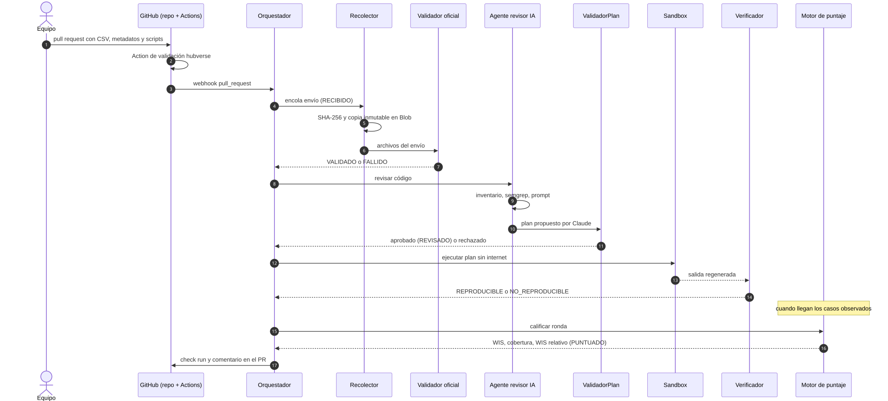
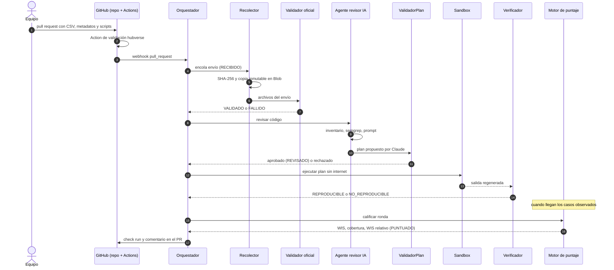

# Secuencia de un envío

La validación de GitHub Actions es rápida y gratuita, y avisa al equipo en segundos. La validación oficial se repite en Azure porque es la que cuenta.

## Fuente Mermaid

```mermaid
sequenceDiagram
  autonumber
  actor E as Equipo
  participant G as GitHub (repo + Actions)
  participant O as Orquestador
  participant R as Recolector
  participant V as Validador oficial
  participant A as Agente revisor IA
  participant P as ValidadorPlan
  participant S as Sandbox
  participant Q as Verificador
  participant M as Motor de puntaje
  E->>G: pull request con CSV, metadatos y scripts
  G->>G: Action de validación hubverse
  G->>O: webhook pull_request
  O->>R: encola envío (RECIBIDO)
  R->>R: SHA-256 y copia inmutable en Blob
  R->>V: archivos del envío
  V-->>O: VALIDADO o FALLIDO
  O->>A: revisar código
  A->>A: inventario, semgrep, prompt
  A->>P: plan propuesto por Claude
  P-->>O: aprobado (REVISADO) o rechazado
  O->>S: ejecutar plan sin internet
  S-->>Q: salida regenerada
  Q-->>O: REPRODUCIBLE o NO_REPRODUCIBLE
  Note over M: cuando llegan los casos observados
  O->>M: calificar ronda
  M-->>O: WIS, cobertura, WIS relativo (PUNTUADO)
  O->>G: check run y comentario en el PR
```
